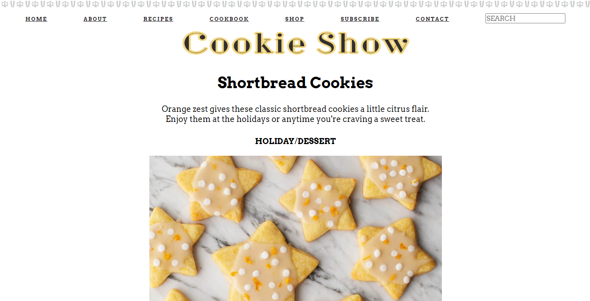

# Cookie Show - Ironhack Portfolio


## About The Project
This code was created during the 7th week of the UX/UI bootcamp at Ironhack Sao Paulo. We had 6 huors to create the code from scratch after a week of coding lectures.




### Built With:

* [HTML5]
* [CSS3]


<!-- USAGE EXAMPLES -->
## Usage

The project is deployed and can be accessed at https://brunoaraujog.github.io/portfolio-ironhack-2020/


<!-- CONTRIBUTING -->
## Contributing


1. Fork the Project
2. Create your Feature Branch
```sh
git checkout -b feature/AmazingFeature
```
3. Commit your Changes
```sh
git commit -m 'Add some AmazingFeature'
```
4. Push to the Branch
```sh
git push origin feature/AmazingFeature
```
5. Open a Pull Request


<!-- CONTACT -->
## Contact

Bruno Araujo - [email](mailto:brunoaraujog@gmail.com) - [linkedin](https://www.linkedin.com/in/brunoaraujog/)

